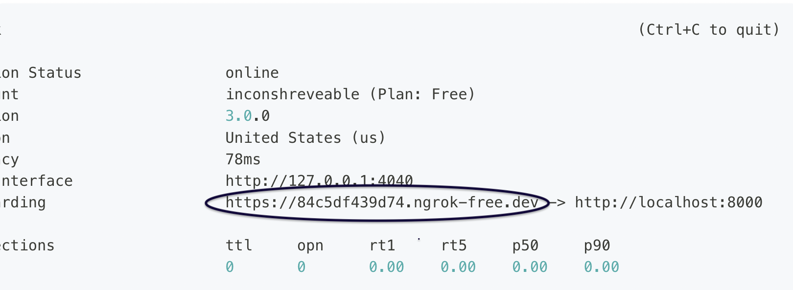

# Feeding Web Interface

This directory contains the web app that users use to interact with the robot-assisted feeding system. This readme includes an overview and contribution guidelines, while [TechDocumentation.md](https://github.com/personalrobotics/feeding_web_interface/tree/main/feedingwebapp/TechDocumentation.md) includes more specific documentation of the technical aspects of the app.

## Overview
The overall user flow for this robot can be seen below.

(Last Updated 2023/03/07)
<!--  
(Last Updated 2022/09/20) -->

## Dependencies
- [Node.js](https://nodejs.org/en/download/package-manager)
- [ROS2 Humble](https://docs.ros.org/en/humble/Installation.html)
- [PRL fork of rosbridge_suite](https://github.com/personalrobotics/rosbridge_suite). This fork enables rosbridge_suite to communicate with ROS2 actions.

## Getting Started in Computer

### Installation
1. Navigate to your ROS2 workspace: `cd {path/to/your/ros2/workspace}`
2. Clone the repo: `git clone git@github.com:personalrobotics/feeding_web_interface.git` using SSH, or `git clone https://github.com/personalrobotics/feeding_web_interface.git` using HTTPS
3. Install the ROS2 packages: `colcon build`
4. Source the directory: `source install/setup.bash`
5. Navigate to the web app folder: `cd feeding_web_interface/feedingwebapp`
6. Install web app dependencies: `npm install --legacy-peer-deps`

### Usage (Web App)
1. Navigate to the web app folder: `cd {path/to/feeding_web_interface}/feedingwebapp`
2. Start the app: `npm start`
  - Note that if you're not running the robot code alongside the app, set [`debug = true` in `App.jsx`](https://github.com/personalrobotics/feeding_web_interface/tree/main/feedingwebapp/src/App.jsx#L17) to be able to move past screens where the app is waiting on the robot. Since the robot is not yet connected, the default is `debug = true`
3. Use a web browser to navigate to `localhost:3000` to see the application.

## Getting Started in Smartphone

### When your phone and a computer both are connected to the same network of PRL 
1. Connect your phone to the same wifi network in the PRL lab that the computer is connected to (e.g., ADA_5G which is used by lab computers like weebo, tobi, ed209). 
2. Run the app in the computer following the above "Getting Started in Computer" instructions. When the app is running in the computer, copy the port number from the app tab's browser and include it after the computer’s IP address followed by a colon (something like `192.xxx.x.x:3000`). The IP addresses of the computers in the PRL lab can be found [here](https://github.com/personalrobotics/pr_docs/wiki/Networking-and-SSH-Information). Depending on which computer is launching the app, use that computer’s IP address in the URL.
3. Then go to that address from the browser in your phone. Then, the app should be running on your phone too. 

### When your phone and a computer are connected to two different networks (only one or neither connected to PRL network)
1. Run the app in the computer following the above "Getting Started in Computer" instructions. 
2. When the app is running in the computer, open another terminal in the computer and install the ngrok agent following [this tutorial](https://ngrok.com/docs/getting-started/#step-2-install-the-ngrok-agent).
3. Then, follow [this tutorial](https://ngrok.com/docs/getting-started/#step-3-connect-your-agent-to-your-ngrok-account) to connect your agent to your ngrok account. Basically, run this command `ngrok config add-authtoken TOKEN` in the terminal with `TOKEN` replaced by the authtoken from your ngrok account.
4. Now, start ngrok by running this command `ngrok http 3000` in the terminal where `3000` is the port number for the app running on the computer with the localhost. 
5. Get part of the Forwarding URL from the console UI shown in your terminal that is before the arrow sign as marked in the image below. Then, run it from your phone browser. You should now see the app ruuning on the phone. For more details on this, follow [this tutorial](https://ngrok.com/docs/getting-started/#step-4-start-ngrok). 
6. That URL can be accessed by anyone in the world. You can stop the ngrok agent with `ctrl+c`.

### Usage (Test ROS)
There is a special page in the app intended for developers to: (a) test that their setup of the app and ROS2 enables the two to communicate as expected; and (b) gain familiarity with the library of ROS helper functions we use in the web app (see [TechDocumentation.md](https://github.com/personalrobotics/feeding_web_interface/tree/main/feedingwebapp/TechDocumentation.md)). Below are instructions to use this page:
1. Navigate to your ROS2 workspace: `cd {path/to/your/ros2/workspace}`
2. Build your workspace: `colcon build`
3. Launch rosbridge: `ros2 launch rosbridge_server rosbridge_websocket_launch.xml`
4. In another terminal, navigate to the web app folder: `cd {path/to/feeding_web_interface}/feedingwebapp`
5. Start the app: `npm start`
6. Use a web browser to navigate to `localhost:3000/test_ros`.

The following are checks to ensure the app is interacting with ROS as expected. If any of them fails, you'll have to do additional troubleshooting to get the web app and ROS2 smoothly communicating with each other.
1. First, check if the page says `Connected` at the top of the screen. If not, the web app is not communicating with ROS2.
2. Then, use the web app to create a topic, in a terminal window run `ros2 topic echo /{topic_name}`, and then use the web app to publish a message on that topic. Ensure the message is echo-ed in your terminal.
3. Then, use the web app to set a topic to subscribe to, and in a terminal window run `ros2 topic pub /{topic_name} std_msgs/String "{data: \"your_message_here\"}" -1`. The message should render on web app.
4. Then, in a terminal window run `ros2 run feeding_web_app_ros2_test reverse_string`. In the web app, provide a string to reverse. The reversed string should render on the web app.
5. Then, in a terminal window run `ros2 run feeding_web_app_ros2_test sort_by_character_frequency`. In the web app, enter a string and click "Call"; you should see feedback as it arrives, and the unique characters in the string sorted from most frequent to least after it is done. Then in the web app, enter another string, press "Call," and press "Cancel" before it is done. You should see that the action gets canceled. (Note that after receiving the message that the action is canceled, the web app may then receive the message that the action failed; that is known behavior.)

## Contributing

### Documenting Tasks

All tasks should be tracked and documented as [Github Issues](https://github.com/personalrobotics/feeding_web_interface/issues).

### Adding Dependencies
Note that we use `npm`, not `yarn`, to manage dependencies for this project.
- Dependencies added with `npm install ...` should automatically be added when you add `package.json` and `package-lock.json` to your branch.
- Additional dependencies should be documented in this readme.

### Writing Code
- Generally, only work on code if there is a corresponding [Github Issue](https://github.com/personalrobotics/feeding_web_interface/issues) for it.
- Every feature should be on its own branch, and generally only one person should be pushing to one branch.
- Follow the below style guides:
  - [AirBnB React/JSX Style Guide](https://airbnb.io/javascript/react/). This was written before React hooks (e.g, `useState`); see [this for an example of how to order calls to various hooks](https://dev.to/abrahamlawson/react-style-guide-24pp#comment-1f4fd).
  - [AirBnB JavaScript Style Guide](https://airbnb.io/javascript/) for anything not covered in the above guide (e.g., variable naming conventions).
  - [React Styleguidist guide](https://react-styleguidist.js.org/docs/documenting/) for documenting code. Every function and component should be documented, and within functions there should be enough documentation that someone without knowledge of React can understand it.
- Before writing code, read through [TechDocumentation.md](https://github.com/personalrobotics/feeding_web_interface/tree/main/feedingwebapp/TechDocumentation.md) so you are aware of any technical norms followed for this repository.
- Thoroughly test your feature:
  - Run `npm start`, ensure it has no warnings or errors.
  - Thoroughly test your feature, including all edge cases, to ensure it works as expected. This includes trying every combination of buttons/actions, even ones we don't expect users to use, to ensure there are no unaccounted for edge cases.
  - Ensure the [console](https://developer.chrome.com/docs/devtools/console/) has no errors.
  - Thoroughly test responsivity by changing browser/device size to ensure it renders as expected.
- Before creating a Pull Request, run `npm format` and address any warnings or errors.
- Create a Pull Request to merge your branch into `main`. You need at least one approving review to merge.
- Squash all commits on your branch before merging into `main` to ensure a straightforward commit history.